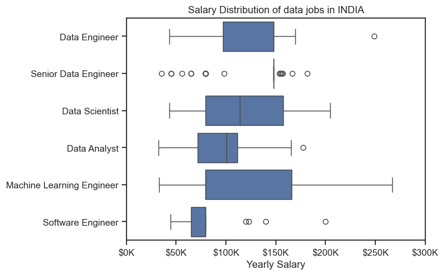
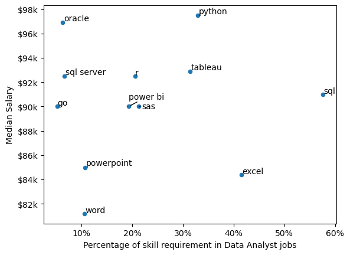
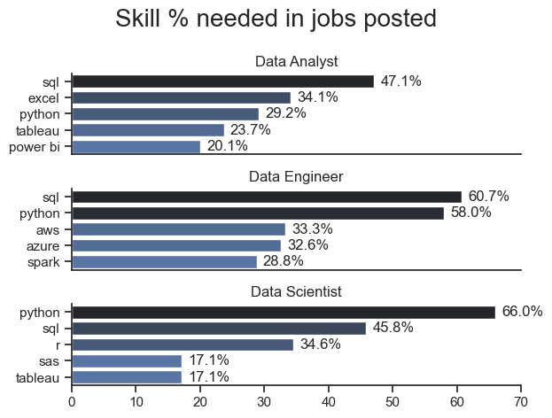
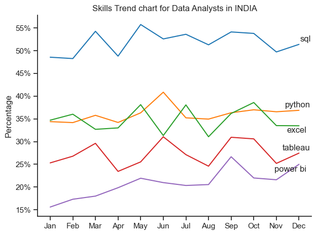

# Python Project on Data Jobs
This project aims to find insights and analyze trends related to data jobs.


## Overview
A comprehensive Python project aimed at analyzing the salary trends, required skills, and career opportunities in the data job market. The project helps individuals understand the most in-demand skills, the highest-paying roles, and which data-related career paths align with their skillsets.

 The dataset used for this project was sourced from Luke Baraouuse's Python course, which includes job titles, salaries, locations, and skills required for various data roles. I have used this dataset to build this project and enchance my skills. The aim of the project is to provide actionable insights to help individuals make informed career decisions based on salary expectations and required skillsets.


## Data Description
The dataset used in this project was sourced from Luke Baraouuse's Python course, containing job listings with the following columns:

Job Title: The title of the job position (e.g., Data Scientist, Data Analyst).

Salary: The salary range or value for the position.

Location: The location where the job is being offered (e.g., San Francisco, New York).

Skills: The skills required for the role (e.g., Python, Machine Learning, SQL).

Job Type: Job Type whether it's full time, part time or remote.

Company: The name of the company offering job.


## QUESTIONS:
The question I have explored in the project are given below:

1. Salary analysis for different data jobs.
2. Skills needed in percentage of data analyst jobs.
3. Top 5 skills needed in top data jobs in India
4. Skills Trend visualization for data analysts in India.

## Data Preparation and Cleanup:

This step involves data preparation, including importing libraries, loading the dataset, and performing essential cleanup to ensure the data is ready for analysis.

### Import Libraries and dataset
I started wwith loading neccesary libraries and dataset.

```python
import pandas as pd
from datasets import load_dataset
import matplotlib.pyplot as plt 
import ast
import seaborn as sns

#loading dataset
dataframe = load_dataset('lukebarousse/data_jobs')

df = dataframe['train'].to_pandas()

#cleanup (transforming date column)
df['job_posted_date'] = pd.to_datetime(df['job_posted_date'])

#transforming job skills column into a list
df['job_skills'] = df['job_skills'].apply(lambda x: ast.literal_eval(x) if pd.notna(x) else x)
```
### Filtering Indian Jobs
This step involves filtering the data to include only Indian job listings and dropping rows with missing salary information to ensure clean and relevant data for analysis.
```python
df_in = df[df['job_country']=='India']

#dropping NA salary rows
df_in = df_in.dropna(subset='salary_year_avg').copy() 
```

## Analysis:

I approached each question using Jupyter Notebooks, performing data cleaning, EDA, and visualizations to provide meaningful insights and support data-driven conclusions.

### 1. Salary analysis for different data jobs.
This analysis focuses on evaluating the salary distribution for various data-related roles in India, such as Data Analysts, Data Scientists, and Data Engineers. By comparing salaries across these positions, the goal is to uncover trends and  helping to understand the financial dynamics of the data job market in India.

Check out my notebook for detailed steps: 
[Salary_for_datajobs](project/Salary_for_datajobs.ipynb)

#### Visualizing the data
```python
sns.boxplot(data=top6df, x='salary_year_avg', y='job_title_short', order= order)
sns.set_theme(style='ticks')

plt.title('Salary Distribution of data jobs in INDIA')
plt.xlabel('Yearly Salary')
plt.ylabel('')
plt.xlim(0,300000)
ax = plt.gca()
ax.xaxis.set_major_formatter(plt.FuncFormatter(lambda x, pos: f'${int(x/1000)}K'))
```

#### Results



#### Insights

1. Data Engineers Have the Highest Median Salary

Among all roles, Data Engineers have the highest median salary, meaning most professionals in this field earn well. Their salary range is also well-defined, indicating stable earnings compared to other roles.
But when it comes to highest salary Data Scientist and Machine Learning Engineer earns more.

2. Machine Learning Engineers Have the Widest Salary Range

The large variation in Machine Learning Engineer salaries suggests that this field offers both entry-level and highly specialized, well-paid roles. This could be due to differences in required expertise, experience, and company demand.

3. Senior Data Engineers Show Many High-Paying Outliers

The presence of multiple high outliers for Senior Data Engineers indicates that some professionals in this field earn significantly more than the typical salary range, likely due to expertise, industry demand, or leadership 
roles.

### 2. Skills needed in percentage of data analyst jobs.
This analysis explores the most in-demand skills for Data Analyst roles in India, highlighting the percentage of jobs that demand specific skills. It highlights the essential technical and analytical skills required, helping professionals understand which competencies to focus on for career growth. Whether you're starting out or looking to upskill, this analysis provides valuable insights into industry expectations.

Check out my notebook for detailed steps: 
[Skills_percentage](project/Skills_count_in_jobs.ipynb)

#### Visualizing the data
```python
#needed to import before visualization
from adjustText import adjust_text
from matplotlib.ticker import PercentFormatter

#visualizing
data_group.plot(kind='scatter', x='percent', y='median')

texts = []

for i, txt in enumerate(data_group.index):
    texts.append(plt.text(data_group['percent'].iloc[i], data_group['median'].iloc[i], txt))

adjust_text(texts, arrowprops=dict(arrowstyle='->'))

ax = plt.gca()
ax.yaxis.set_major_formatter(plt.FuncFormatter(lambda y, pos: f'${int(y/1000)}k'))
ax.xaxis.set_major_formatter(PercentFormatter(decimals=0))

plt.ylabel('Median Salary')
plt.xlabel('Percentage of skill requirement in Data Analyst jobs')

plt.show()
```

#### Results


#### Insights
  

1. **SQL is the Most In-Demand Skill (~60%)**  
   - SQL appears in the highest percentage of job postings, making it the most essential skill for Data Analysts. However, its median salary is slightly lower than some specialized skills.  

2. **Python Offers the Highest Earning Potential (~$98K)**  
   - While required in fewer jobs (~30%), Python has the highest median salary, indicating that jobs requiring Python tend to be higher-paying and more advanced.  

3. **Excel is Widely Required but Lower Paying (~$84K)**  
   - Excel is essential for many Data Analyst roles (~45%), but jobs emphasizing Excel tend to have lower median salaries, suggesting it is a fundamental rather than a specialized skill.  

4. **Specialized Tools (Oracle, SQL Server, R) Have Niche Demand but Pay Well**  
   - Tools like Oracle, SQL Server, and R appear in fewer job postings, indicating that mastering these can lead to well-paying niche opportunities.  

### 3. Top 5 skills needed in top data jobs in India
This analysis identifies the top five most in-demand skills for high-paying data jobs in India. By analyzing job market trends, it highlights the essential technical and analytical skills required for roles like Data Analyst, Data Scientist, and Data Engineer. Understanding these key skills will help professionals and aspiring candidates focus on the right areas for career growth in the data industry.

Check out my notebook for detailed steps:
[Top_5_skills_for_top_3_roles](project/skills_project.ipynb)

#### Visualizing The Data
```python
fig, ax = plt.subplots(3,1)

for i, job_title in enumerate(job_list):
    ploting = data_merge[data_merge['job_title_short'] == job_title].head(5)
    sns.barplot(ploting, x='percent', y='job_skills', ax=ax[i], hue='percent', palette='dark:b_r')
    ax[i].set_ylabel('')
    ax[i].set_title(job_title)
    ax[i].get_legend().remove()
    ax[i].set_xlim(0,70)
    ax[i].set_xlabel('')

```

#### Results



#### Insights

1. **SQL and Python Dominate Across All Data Roles**  
   - SQL is the most in-demand skill for Data Analysts (47.1%) and Data Engineers (60.7%), while Python is the top skill for Data Scientists (66%) and a close second for Data Engineers (58%).  

2. **Data Engineering Requires Cloud & Big Data Skills**  
   - Apart from SQL and Python, Data Engineers need cloud-based skills like AWS (33.3%), Azure (32.6%), and big data tools like Spark (28.8%), highlighting the importance of cloud computing in this role.  

3. **Excel Remains Crucial for Data Analysts**  
   - Excel is still highly relevant (34.1%) for Data Analysts, reinforcing its role in reporting, data manipulation, and visualization, despite more advanced tools being available.  

4. **R and SAS Have Limited but Specialized Demand**  
   - R (34.6%) and SAS (17.1%) appear in Data Scientist job requirements, indicating they are useful for statistical analysis but not as universally required as Python or SQL.  

### 4. Skills Trend visualization for data analysts in India.

This analysis presents a visual analysis of the skill trends for Data Analysts in India. It showcases the long-term sustainability of key skills like SQL, Python, Excel, and data visualization tools are expected to remain in high demand, helping professionals identify the most valuable competencies. By understanding these trends, aspiring Data Analysts can make informed decisions about skill development and career growth. 

Check out my notebook for detailed steps:
[Skills_trend](project/skills_trend.ipynb)

#### Visualizing the Data
```python
sns.lineplot(data=plot, dashes=False, palette='tab10')
sns.set_theme(style='ticks')
sns.despine()

plt.title('Skills Trend chart for Data Analysts in INDIA')
plt.xlabel('')
plt.ylabel('Percentage')
```

#### Results


#### Insights

1. **SQL Remains the Most In-Demand Skill**  
   - SQL consistently holds the highest percentage (~50-55%) throughout the year, confirming its long-term importance for Data Analysts.  

2. **Python and Excel Compete Closely**  
   - Python and Excel show similar demand trends (~35-40%), indicating that both programming and spreadsheet skills are crucial for analysts.  

3. **Tableau and Power BI Are Growing but Less Stable**  
   - Tableau and Power BI, though important for data visualization, show fluctuations, suggesting varying demand based on industry needs and company preferences.  

4. **Power BI Shows an Upward Trend**  
   - Power BI starts at ~15% but gradually increases, indicating a rising preference for this tool in the data analytics space.  

## WHAT I LEARNED


1. **Advanced Python for Data Analysis** – Gained proficiency in using Python for data analysis, including mastering powerful libraries like Pandas, Matplotlib, and Seaborn for data manipulation, visualization, and exploration.  

2. **The Importance of Data Cleaning** – Understood how crucial data cleaning is in ensuring accurate, reliable, and meaningful analysis by handling missing values, duplicates, and inconsistencies effectively.  

3. **Enhanced Data Analysis Skills** – Deepened my ability to extract insights from data, apply statistical techniques, and create compelling visualizations to support data-driven decision-making.  

## TOOLS USED:

### **Tools Used**  

- **Python** – The core programming language for data analysis and manipulation.  

 **LIBRARIES** 

 *Pandas* – Used for data cleaning, transformation, and analysis.  
*Matplotlib* – Employed for creating detailed and customizable visualizations.  
 *Seaborn* – Utilized for advanced statistical and aesthetically appealing data visualizations.  
- **Jupyter Notebooks** – The tool I used for writing, testing, and visualizing Python code.  
- **VS Code** – Software I used for writing and running python scripts.  
- **GitHub** – Used for version control and sharing project code.  
- **Dataset Source** – Data obtained from Luke Barausse’s Python course.  

## CONCLUSION 
### **Conclusion**  

This project provides valuable insights into data jobs in India, analyzing salary distributions and skill requirements across various roles. By comparing different data jobs, it helps individuals understand which career path aligns best with their skills, interests, and long-term goals. Whether evaluating salary trends or identifying in-demand skills, this analysis serves as a useful guide for making informed career decisions in the data industry.
